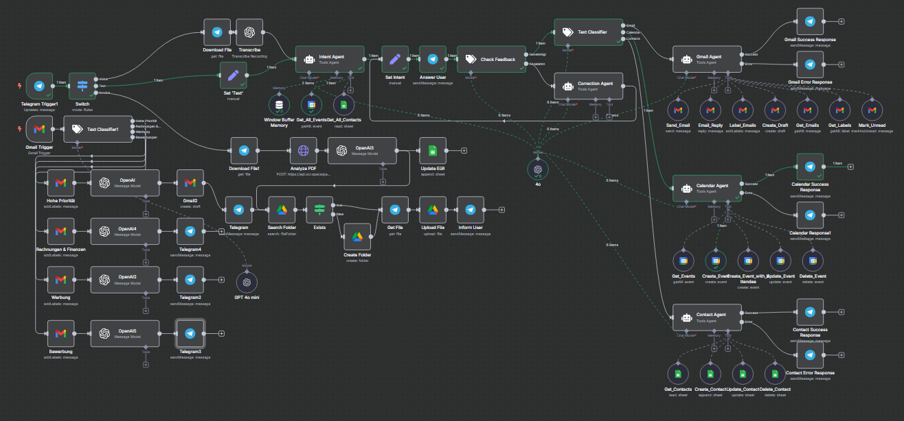

# 🛡️ Smart Inbox Guardian (n8n Workflow)

Ein KI-gestützter E-Mail-Assistent mit n8n – automatisiert die Sortierung, Analyse und Bearbeitung deiner E-Mails. Ideal für alle, die ihre Inbox effizienter verwalten und repetitive Aufgaben delegieren möchten.

## ✨ Funktionen

- **📥 E-Mail-Klassifikation**: Sortiert Mails automatisch in Kategorien wie „Hohe Priorität“, „Rechnungen“, „Werbung“, „Bewerbung“ etc. (GPT-gestützt).
- **🧠 GPT-Zusammenfassungen**: Kompakte Zusammenfassungen + Handlungsempfehlungen zu eingehenden Mails.
- **📅 Kalenderintegration**: Erkennt Termine & trägt sie automatisch in Google Calendar ein.
- **📇 Kontaktverwaltung**: Erstellt oder aktualisiert Google-Kontakte anhand von E-Mail-Inhalten.
- **📁 Drive-Automation**: Speichert Anhänge automatisch in strukturierten Google Drive-Ordnern.
- **📊 Rechnungserkennung**: Extrahiert Rechnungsdaten und überträgt sie in eine Tabelle.
- **📲 Telegram-Integration**: Sendet Zusammenfassungen & Benachrichtigungen in Echtzeit.

## ⚙️ Voraussetzungen

- [n8n](https://n8n.io)
- OpenAI API Key
- Google Workspace (Gmail, Calendar, Drive, Contacts)
- Telegram Bot Token
- Optional: Google Sheets (für Ausgabenübersicht)

## 🚀 Schnellstart

1. `workflow.json` in n8n importieren
2. Google & Telegram API-Zugänge einrichten
3. OpenAI-Key hinterlegen

## 📸 Vorschau

## 🧠 Inspiration

Konzipiert als "digitaler Sekretär" für Selbstständige, Vielbeschäftigte & AI-Enthusiasten. Schluss mit E-Mail-Chaos – starte automatisiert in den Tag!

---
